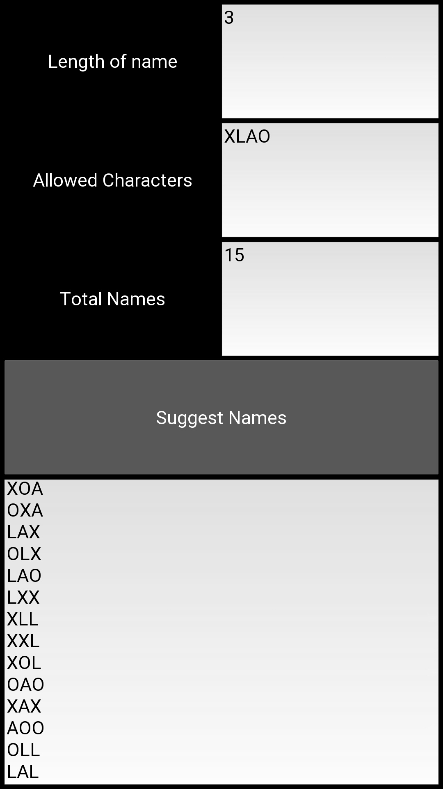

     

          
     

# NameGenerator

A simple Kivy app which gives the name suggestions based on the input config.
1. Length of the name
2. Allowed characters in the name
Total numbers of name to suggest can also be set before generate the name.

## Installation Guide

| Author                                                             | Version        | Last Updated        |
| ------------------------------------------------------------------ |:--------------:| -------------------:|
| [Saurav Kumar](mailto:saur.k10@gmail.com)                          | 1.0.0          | 10th June, 2018     |

### 1. Install global dependencies

     sudo apt-get install virtualenv python-pip

For more details see the kivy installation in virtualenv:

https://kivy.org/docs/installation/installation-linux.html#installation-in-a-virtual-environment

Note: I recommend to install buildozer==0.32, Cython==0.23.1 and kivy==1.9.1 for this app.

### 2. Upgrade `pip` and `setuptools` that are bundled with the OS to the latest stable versions.

     sudo -H pip install pip -U
     sudo -H pip install setuptools -U

### 3. Clone the KivyNameGenerator from github to your preferred directory.

    git clone https://github.com/sauravmahuri2007/kivynamegenerator.git
    cd kivynamegenerator

### 4. Create virtualenv and install project dependencies

    virtualenv venv
    source venv/bin/activate
    pip install -r requirements.txt
    # ignore these steps if you already created a virtualenv in 1st step.

### 5. Run the app

    python main.py
    
## Create an apk file using Buildozer

Refer buildozer installation documentation (installing buildozer in virtualenv is recommended):

http://buildozer.readthedocs.io/en/latest/installation.html

Note: following steps can be used to install buildozer in virtualenv:

    virtualenv buildozerenv
    source buildozerenv/bin/activate
    pip install buildozer==0.32 Cython==0.23.1
    
Also make sure to chance the `requirements = kivy` to `requirements = kivy==1.9.1` in `buildozer.spec` file created after `buildozer init`

